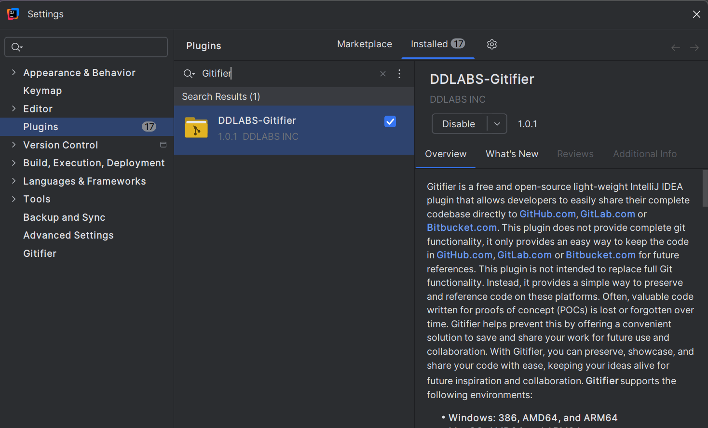

DDLABS Gitifier An IntelliJ IDEA Plugin to share code in Hosted Git Platform
============================================================================
# 🌿 Introduction:
**Gitifier** is a free and open-source light-weight IntelliJ IDEA plugin
	that allows developers to easily share their complete codebase directly
	to
	<a href="https://github.com/"><b>GitHub.com</b></a>,
	<a href="https://gitlab.com/"><b>GitLab.com</b></a> or
	<a href="https://bitbucket.org/"><b>Bitbucket.com</b></a>. This plugin
	does not provide complete git functionality, it only provides an easy
	way to keep the code in
	<a href="https://github.com/"><b>GitHub.com</b></a>,
	<a href="https://gitlab.com/"><b>GitLab.com</b></a> or
	<a href="https://bitbucket.org/"><b>Bitbucket.com</b></a> for future
	references. This plugin is not intended to replace full Git
	functionality. Instead, it provides a simple way to preserve and
	reference code on these platforms. Often, valuable code written for
	proofs of concept (POCs) is lost or forgotten over time. Gitifier helps
	prevent this by offering a convenient solution to save and share your
	work for future use and collaboration. With Gitifier, you can preserve,
	showcase, and share your code with ease, keeping your ideas alive for
	future inspiration and collaboration.

**Gitifier** supports the following environments:

- **Windows: 386, AMD64, and ARM64**
- **MacOS: AMD64 and ARM64**
- **Linux Alpine: 386 and AMD64**
- **Linux: 386, AMD64, and ARM64**

# 🔑Key Features:

- **Idea/Poc Preservation:** Your ideas deserve to be saved. Gitifier makes sharing effortless.
- **One Click Sharing:** From IntelliJ idea to GitHub,Gitlab, or Bitbucket—Gitifier keeps your code future-ready.

# 💻 Technology Stack
The following framework/s and tool/s have been used in this current sample application.

<table>
  <tr>
    <th>Name</th>
    <th>Version</th> 
  </tr>
  <tr>
    <td>Java</td>
    <td>17</td> 
  </tr>
  <tr>
    <td>IntelliJ Platform (Open API & Swing)</td>
    <td>2025</td>
  </tr>
  <tr>
    <td>Gradle</td>
    <td>8.14.3</td>
  </tr>
</table>

# 💧 How to use it ?
Go to File -> Settings -> Plugins and type `DDLABS Gitifier` in intellij idea marketplace and click the button `install`. 
The screenshot is given below.

# 🌐 Generation of token and usage in Gitifier Setting
	
	
### 💻Generate Github Classic Token

❌ Do not generate Github fine grained token

	Follow the steps below:
	
- Log in to [**github.com**](https://github.com).  
- Click on your profile picture in the upper-right corner of any page, then select **Settings** from the dropdown menu.  
- In the left sidebar, scroll down and click **Developer settings**.  
- Under **Personal access tokens**, click **Tokens (classic)**.  
- Click the **Generate new token** button, then select **Generate new token (classic)**.  
- In the **Note** field, enter a descriptive name for your token to help remember its purpose.  
- Set an expiration date for the token.  
- Select the following scopes (permissions) by checking the boxes:
  - `repo`
  - `workflow`
  - `write:packages`
  - `delete:packages`
  - `admin:org`
  - `notifications`
  - `user`
  - `delete_repo`
  - `codespace`
  - `project`
  
- Click the **Generate token** button at the bottom of the page.  
- Immediately copy the generated token and save it in a secure location.  
- Open **Gitifier settings**, double-click the **Username** column and provide your username along with your email ID.  
- Paste the generated token into the **Token** column. 

### 💻Generate Gitlab Personal Access Token
- Sign in to your GitLab account.
- In the upper-right corner, select your avatar from the dropdown menu, then choose **Edit profile**.  
- On the left sidebar, select **Personal Access Tokens**.  
- Click the **Add new token** button.  
- In the **Token name** field, enter a descriptive name for the token.  
- In the **Expiration date** field, set an expiration date as a security best practice.  
- Select the following desired scopes (permissions) for the token:
  - `read_user`
  - `read_repository`
  - `read_api`
  - `self_rotate`
  - `write_repository`
  - `api`
- Click **Create token**.  
- Immediately copy the generated token and save it in a secure location.  
- Open **Gitifier settings**, double-click the **Username** column and provide your username along with your email ID.  
- Paste the generated token into the **Token** column.  

### 💻Generate Bitbucket Access Token</h4>
	
- Go to [bitbucket.org](https://bitbucket.org), click on the settings icon, or use this link: [Bitbucket App Passwords](https://bitbucket.org/account/settings/app-passwords/).  
- Click on this link: [Atlassian API Tokens](https://id.atlassian.com/manage-profile/security/api-tokens).  
- Click the blue button **"Create API token with scopes"**.  
- Provide a name and expiration date, then click **Next** and select the **"Bitbucket"** radio button.  
- Open the **Scope actions** dropdown, select **All**, and check all boxes to save time.  
- Click the **Create token** button.  
- Immediately copy the generated token and save it in a secure location.  
- Open **Gitifier settings**, double-click the **Username** column and provide your username along with your email ID.  
- Paste the generated token into the **Token** column. 

# 🌟 Why Gitifier: 
In modern development, valuable code is often created during
	experiments, prototypes, or proofs of concept. Unfortunately, much of
	this work is left behind and eventually forgotten. Gitifier addresses
	this problem by making it effortless to preserve and share entire
	codebases directly from IntelliJ IDEA to platforms like
	<b>GitHub</b>, 	<b>Gitlab</b>, or <b>Bitbucket</b>

# ❤️ Why You’ll Love It
**Gitifier** is a small light-weight plugin which ensures the following.

- **Ideas aren’t lost:** Even quick prototypes can be saved for future reference.
- **Collaboration is easier:** Teams can access and build upon shared codebases without complex Git setup.
- **Knowledge is retained:** Developers can revisit past work, learn from it, or repurpose it for new projects.
- **Time is saved:** Instead of manually configuring repositories, Gitifier provides a streamlined path to keep code safe
			and accessible.

# 🐛Bugs and Feedback
There may be some bugs or error, please feel free to report/contact me 📫 **deba.java@gmail.com**

# 📄 License
©Copyright 2025 Debadatta Mishra(DD)
Free and Open Source licensed under the Apache License, Version 2.0.

✍️ Contributor: **Debadatta Mishra(DD/PIKU)**

# 👉 Gitifier: A creation from Tornado
From the visionary mind at Tornado comes **Gitifier** — an attempt by an Engineer to solve real problems and to simplify developers’ lives.
🧐 Wanna to 🤝 join with me to a new challenging technical task ? I will be thankful to you for few words of appreciation 🙏.

### 👦 About Me
-  A developer who crafts with Java’s enterprise power 
    and Python’s versatility.
- 😌 A simple, sober, unsphisticated and unpretentious person.
- 😧 Passing through a difficult phase of life.
- 🕉️ A strong believer in God & 🙏 to 

